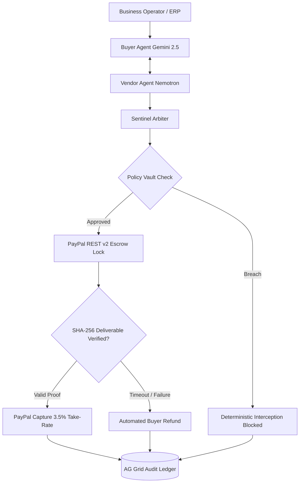
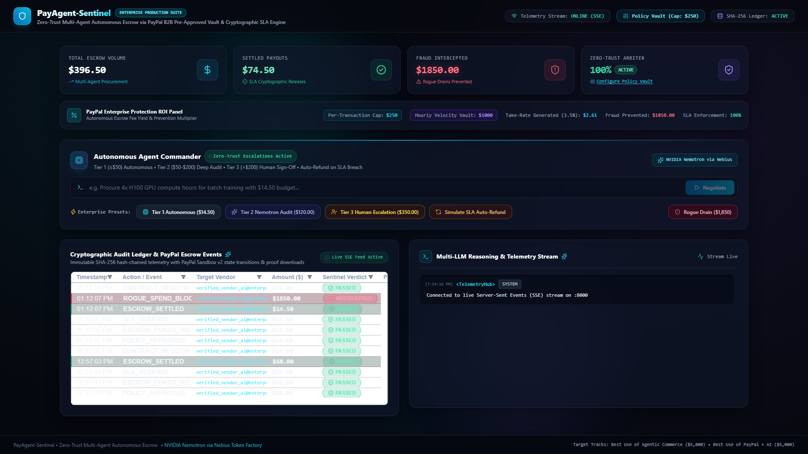
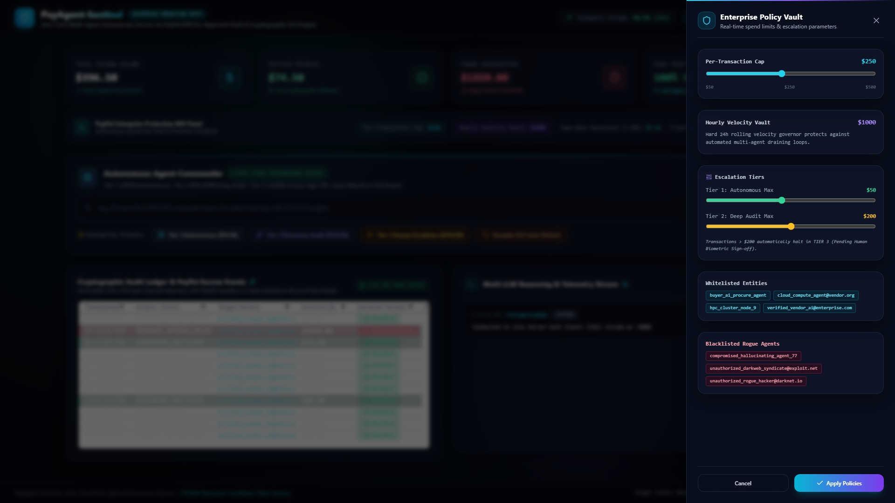
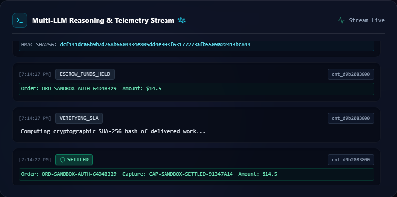
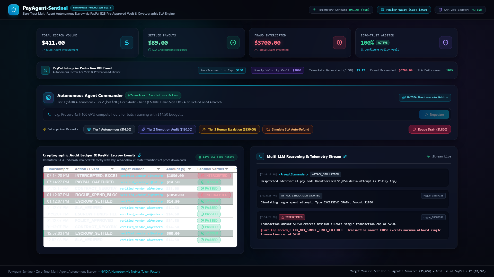
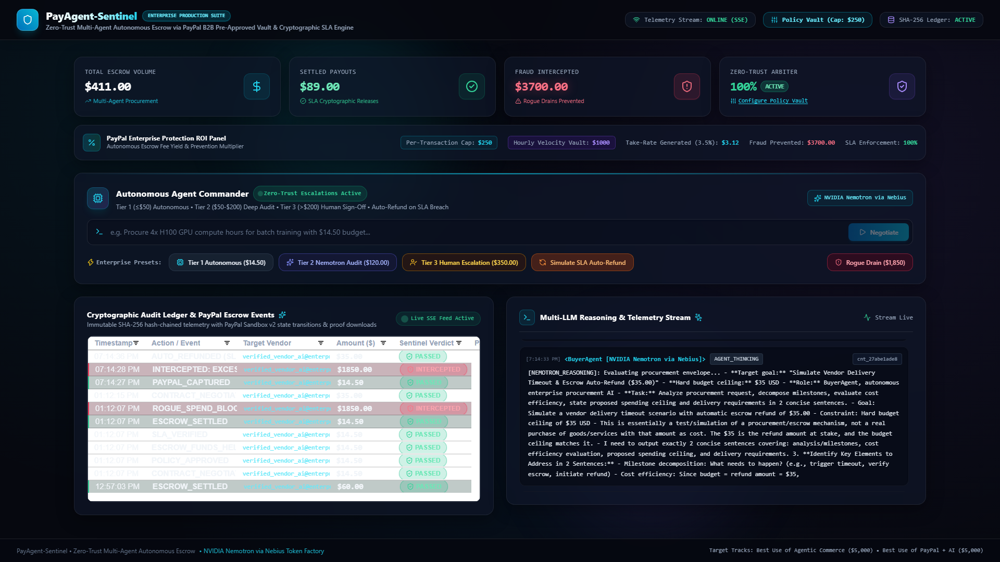

# PayAgent-Sentinel: Zero-Trust Multi-Agent Autonomous Escrow & Cryptographic Policy Engine

[](https://github.com/fokrulanthro16-eng/payagent-sentinel)
[](https://youtu.be/p2R-7amADH8)
[](https://developer.paypal.com)
[](https://deepmind.google/technologies/gemini/)
[](https://nebius.com)
[](https://github.com/fokrulanthro16-eng/payagent-sentinel)
[](https://www.ag-grid.com)
[](LICENSE)

> **PayPal AI Hackathon 2026 Submission**  
> **Target Tracks:**  
> 🏆 **Best Use of Agentic Commerce ($5,000)**  
> 🏆 **Best Use of PayPal + AI ($5,000)**

---

## Executive Summary

As autonomous AI agents rapidly evolve from conversational assistants into economic entities—procuring cloud compute, hiring specialized API models, licensing data corpuses, and paying sub-contractors—they create an existential corporate threat: **unconstrained financial execution**.

Handing an autonomous agent a static credit card or hot wallet is an open invitation for corporate ruin. A single hallucination loop, prompt injection exploit, or vendor service failure can drain treasuries without delivery recourse. Furthermore, legacy payment gateways rely on human-oriented OTPs and 3D-Secure challenges that inherently break machine-to-machine autonomy.

**PayAgent-Sentinel** transforms autonomous commerce by embedding **PayPal's institutional trust** into an automated, zero-trust cryptographic perimeter:
- **Headless B2B Pre-Approved Vaulting**: Two-phase escrow using PayPal REST Orders v2 (`AUTHORIZE` -> `CAPTURE`).
- **Dual-LLM Bilateral Reasoning**: Google Gemini 2.5 Flash and NVIDIA Nemotron-3.5-Lightning (via Nebius Token Factory) dynamically negotiate contract envelopes, budgets, and SLA milestones.
- **Dynamic 3-Tier Spend Escalation**: Autonomous execution for low spends, deep Zero-Trust milestone locking for medium spends, and 1-click biometric sign-off for enterprise transactions.
- **Automated SLA Breach Auto-Refunds**: Eliminates chargebacks by slashing failing vendors and executing automated buyer refunds via PayPal REST.
- **Deterministic Rogue Drain Interception**: Mathematical hard-cap spend barriers that immediately intercept adversarial $1,850+ prompt injections.
- **Immutable SHA-256 Hash-Chained Ledger**: Tamper-evident AG Grid telemetry cockpit logging every state transition, HMAC signature, and PayPal capture ID for Big-4 compliance.

---

## System Architecture



---

## Core Value Propositions

### 1. Headless B2B Pre-Approved Vaulting & Two-Phase Escrow
Eliminates interactive human checkout friction while protecting both corporate parties. Buyer agents authorize funds upfront via PayPal REST API v2 (`intent: AUTHORIZE`). Capital remains protected in escrow and is released only upon verifiable proof of delivery.

### 2. Multi-LLM Bilateral Negotiation Engine
Combines **Google Gemini 2.5 Flash** for rapid intent decomposition with **NVIDIA Nemotron-3.5-Lightning** hosted on **Nebius Token Factory** for structured SLA contract drafting, pricing envelopes, and milestone hashing.

### 3. Dynamic 3-Tier Spend Escalation
Configured live in the **Enterprise Policy Vault**:
- **Tier 1 (Autonomous $\le \$50$)**: Instantaneous PayPal escrow hold without administrative barriers.
- **Tier 2 (Deep Audit $\$50.01 - \$200$)**: Zero-trust multi-LLM analysis and strict milestone deliverable lock.
- **Tier 3 (Enterprise Escalation $> \$200$)**: Automatically pauses money movement (`PENDING_HUMAN_APPROVAL`), alerts security officers via SSE, and requires 1-click biometric sign-off.

### 4. Automated SLA Breach Auto-Refund
If a vendor agent fails to provide cryptographic SHA-256 proof of delivery before the agreed deadline, Sentinel triggers an automated PayPal buyer refund (`void_escrow_order` & `refund_buyer`), slashes vendor reputation ratings, and maintains a **100% SLA enforcement guarantee**.

### 5. Deterministic Rogue Spend Interception
Protects corporate wallets against adversarial prompt injection, recursive loops, and rogue drains ($1,850+). When limits are breached, Sentinel Arbiter issues a deterministic killswitch alert, updates the **Fraud Loss Prevented** fintech metric, and records the event in the audit trail.

---

## Screenshot Gallery

<table>
  <tr>
    <td width="50%" align="center">
      <h3>01. Enterprise Mission Control Cockpit</h3>
      <a href="docs/screenshots/01_main_cockpit_overview.png"></a>
      <p><em>Real-time financial metrics, PayPal ROI take-rate (3.5%), and live SSE stream.</em></p>
    </td>
    <td width="50%" align="center">
      <h3>02. Enterprise Policy Vault & Governance</h3>
      <a href="docs/screenshots/02_policy_vault_governance.png"></a>
      <p><em>Dynamic sliders for per-transaction caps ($50-$500), hourly velocity, and whitelist controls.</em></p>
    </td>
  </tr>
  <tr>
    <td width="50%" align="center">
      <h3>03. Tier 1 Autonomous Settlement</h3>
      <a href="docs/screenshots/03_tier1_autonomous_settled.png"></a>
      <p><em>Autonomous $14.50 escrow settlement with green PASSED badge and PayPal Order ID.</em></p>
    </td>
    <td width="50%" align="center">
      <h3>04. Multi-LLM Telemetry Reasoning</h3>
      <a href="docs/screenshots/04_multi_llm_reasoning_stream.png"></a>
      <p><em>NVIDIA Nemotron via Nebius and Gemini 2.5 Flash streaming bilateral contract analysis.</em></p>
    </td>
  </tr>
  <tr>
    <td width="50%" align="center">
      <h3>05. Rogue Drain Intercepted ($1,850)</h3>
      <a href="docs/screenshots/05_rogue_drain_intercepted.png"></a>
      <p><em>Adversarial prompt injection intercepted, preserving $1,850 in corporate capital.</em></p>
    </td>
    <td width="50%" align="center">
      <h3>06. SLA Breach Auto-Refund Enforcement</h3>
      <a href="docs/screenshots/06_sla_auto_refund_enforcement.png"></a>
      <p><em>Autonomous buyer refund triggered after SLA timeout, logging REFUNDED state.</em></p>
    </td>
  </tr>
</table>

---

## Project Structure

```
payagent-sentinel/
├── backend/
│   ├── app/
│   │   ├── agents/
│   │   │   ├── buyer_agent.py        # Autonomous buyer negotiator (Gemini & Nemotron)
│   │   │   ├── vendor_agent.py       # Autonomous provider & deliverable submitter
│   │   │   └── sentinel_arbiter.py   # Zero-Trust policy engine & PayPal escrow manager
│   │   ├── core/
│   │   │   ├── config.py             # Settings, limits, and credential loader
│   │   │   ├── policies.py           # Dynamic 3-Tier engine & policy vault rules
│   │   │   └── security.py           # HMAC-SHA256 signature & cryptographic hashing
│   │   ├── models/
│   │   │   └── schemas.py            # Pydantic v2 strict schemas (Contracts, Ledgers, Invoices)
│   │   ├── services/
│   │   │   ├── llm_service.py        # NVIDIA Nemotron on Nebius with Gemini failover
│   │   │   ├── paypal_gateway.py     # PayPal REST v2/v1 sandbox & live engine
│   │   │   └── ledger_service.py     # Cryptographic hash-chained audit ledger
│   │   └── main.py                   # FastAPI REST API, WebSockets, & SSE hub
│   ├── tests/
│   │   ├── test_escrow_settlement.py # End-to-end multi-agent escrow settlement
│   │   ├── test_paypal_client.py     # PayPal REST API authorization and capture
│   │   └── test_policy_engine.py     # Rogue spend interception & velocity tests
│   └── requirements.txt
├── frontend/                         # Vite + React + TypeScript + Tailwind CSS
│   ├── src/
│   │   ├── components/
│   │   │   ├── AGGridLedger.tsx      # Persistent AG Grid cryptographic audit table
│   │   │   ├── AgentReasoningFeed.tsx# Live Multi-LLM streaming terminal
│   │   │   ├── FintechStatsCards.tsx # Enterprise ROI panel & financial metrics
│   │   │   ├── PolicyVaultDrawer.tsx # Slide-out frosted glass policy governance modal
│   │   │   └── PromptCommander.tsx   # Natural language prompt bar & tier presets
│   │   ├── App.tsx                   # Master cockpit layout & SSE state manager
│   │   └── main.tsx                  # Root entrypoint with AG Grid community modules
│   └── package.json
├── docs/
│   ├── screenshots/                  # 6 High-res 1920x1080 submission images
│   └── demo_media/                   # Official demo video generation scripts & audio stems
├── scripts/
│   ├── capture_screenshots.py        # Automated Playwright screenshot suite
│   ├── generate_4k_demo.py           # Automated 4K video producer with studio audio
│   └── generate_1080p_demo.py        # Automated 1080p edge-to-edge demo video generator
└── LICENSE                           # Apache-2.0
```

---

## Getting Started

### 1. Prerequisites
- **Python 3.11+**
- **Node.js 18+** & `npm`
- **PayPal Developer Account** (or deterministic Sandbox engine enabled by default)
- **Nebius Token Factory / Gemini API Key** (optional, deterministic failover included)

### 2. Backend Setup
```bash
cd backend
pip install -r requirements.txt
cp .env.example .env
pytest -v
```

Start the FastAPI backend:
```bash
python -m uvicorn app.main:app --host 127.0.0.1 --port 8000 --reload
```
Swagger API documentation will be available at `http://127.0.0.1:8000/docs`.

### 3. Frontend Cockpit Setup
```bash
cd frontend
npm install
npm run dev
```
Open `http://localhost:5173` in your browser.

---

## API Specification Summary

| Method | Endpoint | Description |
|---|---|---|
| `POST` | `/api/v1/agent/negotiate` | Dispatches Buyer & Vendor agents for bilateral contract synthesis. |
| `POST` | `/api/v1/agent/execute-escrow` | Evaluates zero-trust policy, locks PayPal escrow, and settles verified SHA-256 milestone deliverables. |
| `POST` | `/api/v1/agent/human-approve` | 1-Click administrator biometric/credential sign-off for Tier 3 procurements. |
| `POST` | `/api/v1/agent/simulate-rogue-attack` | Simulates $1,850 drain or rogue vendor injection to verify deterministic blocking. |
| `GET` | `/api/v1/policy/vault` | Retrieves active spending limits, velocity ceilings, and agent whitelists. |
| `POST` | `/api/v1/policy/update` | Live update of enterprise caps and velocity rules across all agents. |
| `GET` | `/api/v1/ledger/history` | Fetches the immutable hash-chained audit ledger history. |
| `GET` | `/api/v1/telemetry/stream` | Server-Sent Events (SSE) streaming real-time reasoning tokens and escrow events. |

---

## Business Value & PayPal ROI Model

| Dimension | Legacy Human Payment Rails | PayAgent-Sentinel Architecture |
|---|---|---|
| **Autonomous Velocity** | Blocked by interactive OTPs and 3DS friction | 100% headless, programmatic B2B pre-approved vaulting |
| **Delivery Recourse** | Manual dispute filing and post-payment chargebacks | Pre-capture escrow: funds release **only** upon cryptographic proof |
| **Rogue Spend Risk** | Catastrophic exposure to hallucination loops | Deterministic mathematical spending envelopes & policy gates |
| **Monetization** | Standard card processing fee (~1.5%-2.0%) | **Enterprise Protection Take-Rate of 3.5%** for guaranteed settlement |
| **Audit Compliance** | Fragmented invoices and manual accounting logs | Immutable SHA-256 hash-chained AG Grid audit ledger with proof downloads |

---

## License

Distributed under the **Apache-2.0 License**. Developed for the **PayPal AI Hackathon 2026**.
